<h1 align="center">🎤</h1>

<h1 align="center">RAP</h1>

<p align="center"><strong>Real Apply Patch</strong> — the file-editing tool for coding agents</p>

<p align="center">
  <a href="https://github.com/francescobianco/rap/actions/workflows/ci.yml"></a>
  <a href="https://github.com/francescobianco/rap/releases/latest"></a>
  <a href="LICENSE"></a>
  
  
</p>

<p align="center">
  
</p>

---

> ### 💸 Your agent is paying to read files it barely changes
>
> 🧠 To change **one line**, the usual loop loads **all 2,000** into the context window — and keeps carrying them, turn after turn.
>
> ⚡ RAP does the same edit for **~50 tokens**. The file is never opened.
>
> 🎯 **Why it works, in three words: `lines, not files`.**
> RAP addresses code **by content, not by coordinates** — so the unit of work is the handful of lines your agent already knows, never a file it has to load.
>
> 🛑 And when a target is ambiguous, it **refuses instead of guessing**. A failure costs a dozen tokens; a wrong `sed -i` costs the rest of the session.

---

## Why it works

Your agent has to change three lines in a 2,000-line file.

**The usual way:** it reads all 2,000 lines into its context window, thinks, writes the change back, and often reads the file *again* to check the edit landed. The whole file is carried into the model — twice. The agent just paid for 1,997 lines it did not care about, and every later turn keeps carrying them.

**With RAP:** it names the text to change, and RAP finds it.

```console
$ rap s app.go 'oldName' 'newName'
updated app.go (lines 1697 -> 1699, bytes +133, replacements 1)
```

The file was never opened by the agent. That one line is the entire answer: the edit landed, exactly once, and the file is now two lines longer. Nothing to re-read, nothing to verify.

That is the whole trick. **RAP addresses code by content, not by coordinates** — so the unit of work is a few lines you already know, never a file you have to load.

### "But the agent needs to see the file"

It needs to see *the lines it is changing*. It already has those — from a grep, from the task, from the code it just wrote a minute ago. It does not need the other 1,997.

And when it genuinely needs to look, RAP hands it a window, not the building:

| The agent's question | What it costs |
|---|---|
| Is this target unique? | `rap m FILE 'text'` → `matches: 1` — **one line back** |
| What will it look like after? | `rap preview -n FILE 40 60 -- s OLD NEW` — **20 lines back** |
| How do I pass this messy text? | `rap q -token @file` → `@b64:…` — **one line back** |
| Did it work? | the command's own receipt — **one line back** |

Four questions an agent asks constantly. None of them costs a file read.

### And when it is not sure, it stops

```console
$ rap s app.go 'count' 'total'
rap: OLD matched 3 times; use -all or a more specific OLD
```

Nothing was written. A failure costing a dozen tokens beats a `sed -i` that confidently edits the wrong occurrence — and gets discovered three steps later, after the agent has built reasoning on top of a corrupted file.

### The token math

| Task | Conventional agent loop | With RAP |
|---|---|---|
| Change one line in a 2,000-line file | read the file (~25,000 tk) → emit a rewrite (~25,000 tk) | `rap s FILE OLD NEW` (~40 tk in, ~20 tk out) |
| Confirm the edit landed | re-read the file or a full diff (~25,000 tk) | the command's own receipt line (~20 tk) |
| Check a target is unique before editing | read and scan the file | `rap m FILE TEXT` → `matches: 1` |
| Inspect the result of an edit | `-dry-run` dumping the whole file | `rap preview -n FILE 40 60 -- s OLD NEW` — only the lines that moved |
| Pass text full of quotes, JSON, newlines | escape, fail, re-escape, fail again | `rap q -token` → `@b64:…`, done in one shot |

<sub>Figures are arithmetic from file size at roughly 4 characters per token, not a measured benchmark — a published one is <a href="ROADMAP.md">on the roadmap</a>. The ratio moves with your file sizes; the mechanism does not.</sub>

The savings are not the point by themselves. The point is what the savings buy: a context window spent on **reasoning about the code** instead of on transporting the code.

### Output designed for a process, not for a reader

Three rules govern everything RAP prints:

1. **One line, and it is the state change.** Counts, line deltas, byte deltas. Facts an agent can branch on, not prose it has to parse.
2. **Ambiguity is an error, never a guess.** Zero matches and three matches both fail. The agent gets a specific instruction — use a more specific `OLD`, use `-all`, add context — not a silent wrong edit.
3. **Nothing is printed that the caller did not ask for.** Want to see the result? Ask for exactly the lines you care about with `preview`. RAP never volunteers a file dump.

This is why RAP makes agents behave more intelligently: not because the model got better, but because every tool response is a clean, unambiguous signal instead of noise the model has to interpret.

---

## Install

### 🤖 From inside your coding agent

The shortest path: paste this into Claude Code, Codex, Cursor, or whatever agent you already have open.

```text
Install this https://github.com/francescobianco/rap
```

It reads this page, picks the binary for your platform, installs it, and drops the instruction file it needs into your repository. Which is the point — the tool is for the agent, so let the agent set it up.

### One line, no toolchain

```sh
curl -fsSL https://raw.githubusercontent.com/francescobianco/rap/main/install.sh | sh
```

Detects your OS and architecture, downloads the prebuilt binary from the latest
[GitHub release](https://github.com/francescobianco/rap/releases/latest), verifies its SHA-256 checksum, and installs it to `~/.local/bin` (or `/usr/local/bin` when run as root).

```sh
# Pin a version, or choose the directory
RAP_VERSION=v1.0.1 RAP_BINDIR=/usr/local/bin curl -fsSL https://raw.githubusercontent.com/francescobianco/rap/main/install.sh | sh
```

### Direct download

Grab the binary for your platform from the [releases page](https://github.com/francescobianco/rap/releases/latest):

```sh
curl -fsSLo rap https://github.com/francescobianco/rap/releases/latest/download/rap_linux_amd64
chmod +x rap && mv rap ~/.local/bin/
```

Available assets: `rap_linux_amd64`, `rap_linux_arm64`, `rap_darwin_amd64`, `rap_darwin_arm64`, `rap_windows_amd64.exe`, plus `SHA256SUMS`.

### With Go

```sh
go install github.com/francescobianco/rap@latest
```

### From source

```sh
git clone https://github.com/francescobianco/rap && cd rap
make install          # builds and installs to ~/.local/bin/rap
make install PREFIX=/usr/local
```

Verify:

```sh
rap version
```

---

## Teach it to your agent in 30 seconds

RAP is meant to be discovered without a human repeating the same instruction in every prompt. Drop the instruction file your agent already reads into the repository:

| Agent | File |
|---|---|
| Claude Code | [`CLAUDE.md`](CLAUDE.md) |
| Codex / OpenAI-style agents | [`AGENTS.md`](AGENTS.md) |
| Anything else that scans project docs | this `README.md` |

The rule fits in one sentence: **inspect with `rap m`, control quoting with `rap q`, reuse snippets with `rap inv`, edit with a RAP command, undo with `rap revert`.**

---

## Quick start

```sh
rap m src/app.go 'func main() {'          # is this target unique?
rap q -token @/tmp/generated.txt          # how should I pass this text?
rap s src/app.go 'old()' 'new()'          # edit it
rap preview -n src/app.go 10 20 -- s 'a' 'b'   # look before you leap
rap revert src/app.go                     # undo the last edit
```

---

## Core syntax

```text
rap [global flags] <command> [command flags] ...
```

Global flags:

```text
-dry-run       print the resulting file instead of writing it
-no-backup     do not create a $HOME/.rap/backup copy before writing
```

### Text arguments — the quoting escape hatch

Every text argument in every command accepts the same input forms:

```text
text           literal text
@path          read text from a file
@-             read text from stdin
@b64:BASE64    decode text from base64
@inv:NAME      read text from this project's inventory
@i:NAME        shorthand for @inv:NAME
@@text         literal text that starts with @
```

This is the single most important feature for an agent. Text containing quotes, backslashes, JSON, shell fragments, or newlines never has to survive a shell escaping round trip — put it in a file or pipe it on stdin and pass `@path` or `@-`. No heredocs, no doubled backslashes, no burned retries.

---

## Commands

### `q` — quoting preflight

```sh
rap q TEXT
rap q -token TEXT
```

Inspects a text argument *before* you build a command with it. Reports byte count, line count, shell risk, the recommended input form, and a ready-to-use token. With `-token`, prints only the safest argument form.

```console
$ rap q 'simple-value'
bytes: 12
lines: 1
shell-risk: low
reason: safe as a bare shell argument
recommended: bare literal
token: simple-value

$ rap q -token @/tmp/messy.json
@b64:eyJhIjogIlwiYlwiIn0K
```

For shell-hostile text, `q -token` returns a `@b64:` token that can be passed directly to any RAP command without quotes, heredocs, or a small religious service for escaping punctuation.

```sh
TOKEN=$(rap q -token @/tmp/replacement.txt)
rap s app.json @/tmp/old.json "$TOKEN"
```

### `m` — match preflight

```sh
rap m FILE TEXT
```

Prints every literal match location and a final count. Run it before `s`, `ia`, `ib`, or `br` when uniqueness is not obvious — it costs one line instead of a file read.

```console
$ rap m src/app.go 'logger'
src/app.go:2:1
src/app.go:48:9
matches: 2
```

### `s` — literal replacement

```sh
rap s [-all] [-pad N] [-trim] [-indent N] FILE OLD NEW
```

Replaces one exact literal match. If `OLD` matches zero times or more than once, RAP exits with an error rather than guessing. Use `-all` only when replacing every match is intentional.

Pass an empty `NEW` (or `@b64:` from `rap q -token ""`) to delete a match. `OLD` must not be empty, since it would match every position in the file.

```sh
rap s README.md 'old text' 'new text'
rap s -pad 4 app.go 'old()' 'new()'
rap s -all app.go @/tmp/old.txt @/tmp/new.txt
```

### `rb` — replace inside required context

```sh
rap rb [-pad N] [-trim] [-indent N] FILE BEFORE OLD AFTER NEW
```

Replaces `OLD` only when the full literal context `BEFORE + OLD + AFTER` exists exactly once. `OLD` must be non-empty, and at least one of `BEFORE` or `AFTER` must be non-empty, so prefix-only or suffix-only anchors are allowed when they are still unique.

Safer than line ranges when nearby lines may shift, and far more compact than building a giant `OLD` block when only the middle should change — which is exactly where agents waste tokens.

```sh
rap rb app.go @/tmp/before.txt @/tmp/old.txt @/tmp/after.txt @/tmp/new.txt
rap p -n app.go 40 55 -- rb @i:before @i:old @i:after @/tmp/new.txt
```

### `ia` / `ib` — insert after or before a marker

```sh
rap ia [-pad N] [-trim] [-indent N] FILE NEEDLE TEXT
rap ib [-pad N] [-trim] [-indent N] FILE NEEDLE TEXT
```

`ia` inserts after a unique marker, `ib` before it. When the insertion point is a line boundary and `TEXT` does not provide its own newline, RAP terminates the inserted block so adjacent lines are not fused.

```sh
rap ia main.go 'func main() {' @/tmp/insert.txt
rap ib README.md '## Commands' $'## Quick Start\n\n'
```

### `br` — replace a block between markers

```sh
rap br [-pad N] [-trim] [-indent N] FILE START END TEXT
```

Replaces the content between `START` and `END` while keeping both markers. The pair must identify exactly one block. This is the right shape for regenerated sections.

```sh
rap br config.yml '# rap:start' '# rap:end' @/tmp/generated.yml
rap br -indent 20 main.go '// rap:start generated' '// rap:end generated' @/tmp/new.go
```

### `mark` — add stable manipulation handles

```sh
rap mark FILE FROM TO NAME
```

Wraps a line range with language-aware `rap:start NAME` / `rap:end NAME` comments, turning anonymous code into a stable target for later `br`, `m`, `mv`, `trim`, or `indent` operations. Line numbers drift; a named handle does not.

```sh
rap mark main.go 80 110 generated-loader
rap br main.go '// rap:start generated-loader' '// rap:end generated-loader' @/tmp/new-loader.go
```

Comment style follows the file type: `<!-- … -->` for Markdown and HTML, `//` for Go/JS/C-family, `#` for Python/YAML/shell, `/* … */` for CSS.

### `preview` / `p` — see only what matters

```sh
rap preview [-n] [-o OUT] FILE FROM TO -- COMMAND [ARGS...]
rap p       [-n] [-o OUT] FILE FROM TO -- COMMAND [ARGS...]
```

Runs a RAP edit against a temporary copy of `FILE`, then prints **only the selected line range** of the result. The source file is never touched. The command after `--` is written like the normal operation but without repeating `FILE`. Add `-n` for a line-number gutter showing edited-result numbers; add `-o OUT` to save the block.

This is the token-saving counterpart to `-dry-run`: inspect a 20-line neighbourhood instead of dumping a 2 000-line file.

```sh
rap preview app.go 10 20 -- s 'oldName' 'newName'
rap preview -n app.go 10 20 -- s -pad 4 'old()' 'new()'
rap preview -n -o /tmp/snippet.go app.go 10 20 -- ia 'func main() {' @/tmp/insert.go
rap preview README.md 40 65 -- mv -indent 12 80 95 45
```

Useful for:

- reviewing the local effect of a replacement in a large file
- reading edited-result line numbers after insertions, deletions, or moves shift the structure
- saving a numbered before/after snippet for a PR comment or another tool
- testing `-pad`, `-trim`, or `-indent` combinations before applying them
- inspecting the destination area after a move or a generated block insertion

### `inv` / `i` — project inventory

```sh
rap inv put NAME TEXT      # or: rap i put NAME TEXT
rap inv get NAME
rap inv list
rap inv rm NAME
rap inv path [NAME]
```

Stores reusable snippets for the current project under `$HOME/.rap/project/<pwd-with-dashes>/inventory`. Use it for markers, boilerplate, and generated blocks an agent would otherwise re-quote — and re-pay for — on every single call.

```sh
rap inv put start '<!-- generated:start -->'
rap inv put end '<!-- generated:end -->'
rap br README.md @inv:start @inv:end @/tmp/generated.md
```

### `write` / `append` / `prepend` — create and grow files

```sh
rap write   [-pad N] [-trim] FILE TEXT
rap append  [-pad N] [-trim] [-indent N] FILE TEXT
rap prepend [-pad N] [-trim] [-indent N] FILE TEXT
```

`write` creates a new file and refuses to overwrite an existing one. `append` and `prepend` add text at the end or start without needing a marker. Together they replace heredocs and throwaway helper scripts when preparing payload files.

```sh
rap write /tmp/payload @b64:aGVsbG8K
rap append CHANGELOG.md @/tmp/generated-entry.md
rap prepend notes.md $'# Title\n\n'
```

### `lr` / `dl` — replace or delete line ranges

```sh
rap lr [-pad N] [-trim] [-indent N] FILE FROM TO TEXT
rap dl FILE FROM TO
```

Line numbers are 1-based and inclusive. `lr` treats `TEXT` as a line block and adds a missing trailing newline for non-empty replacements, preventing fusion with the following line.

Line numbers are intentionally the **least stable selector** in RAP: if the file changes between inspection and application, the same range points at different text. Prefer `s`, `rb`, `br`, or `mark` whenever the target can be named by content or context.

```sh
rap lr README.md 10 12 @/tmp/replacement.md
rap lr -indent 9 main.go 20 30 @/tmp/replacement.go
rap dl debug.log 1 20
```

### `mv` / `trim` / `indent` — move and normalize

```sh
rap mv [-trim] [-indent N] FILE FROM TO DEST
rap trim FILE [FROM TO]
rap indent FILE FROM TO REF
```

`mv` moves the inclusive range `FROM..TO` before line `DEST` in the same file, using coordinates from the original file; `-indent N` reindents the block during the move.

`trim` strips trailing spaces and tabs, normalizes dirty line endings, and leaves a clean final newline. With `FROM TO`, it cleans only that range.

`indent` reindents a range using line `REF` as the base while preserving relative indentation inside the block.

```sh
rap mv README.md 40 52 20
rap mv -indent 79 main.go 80 95 120
rap trim README.md
rap indent main.go 80 95 79
```

### Edit flags

Replacement, insertion, block, line, append/prepend, and move commands accept the same transform flags:

```text
-pad N        prepend N spaces to each non-empty inserted or replacement line
-trim         clean trailing whitespace and the final newline after the edit
-indent N     reindent inserted/replaced/appended/moved text using the indentation of line N
```

`-pad` affects inserted or replacement text only — never `OLD`, `NEEDLE`, or marker text used for matching.

```sh
rap s -pad 4 app.go 'old()' 'new()'
rap ia -trim README.md '<!-- rap:start -->' @/tmp/block.md
rap mv -indent 12 main.go 80 95 100
```

### `revert` — undo

```sh
rap revert FILE
rap revert FILE BACKUP
```

Before every write, RAP stores the previous version under `$HOME/.rap/backup`. `rap revert FILE` restores the latest backup; passing an explicit path restores that snapshot instead.

Backup directories are derived from absolute paths by replacing separators with dashes — `/home/user/project/src/app.go` is stored under `$HOME/.rap/backup/-home-user-project-src-app.go`.

### `version`

```sh
rap version
rap --version
```

Prints the RAP version string — useful in agent logs and reproducible bug reports.

---

## When to reach for RAP

Use RAP when the edit is one of these shapes:

- create a file from a text argument
- append or prepend text without a marker
- replace this exact text with that exact text
- replace text inside a required literal context
- insert text before or after a unique marker
- replace generated content inside stable markers
- replace, move, or delete a known line range
- preview a line range after an edit without touching the source
- combine an edit with padding, trimming, or reindentation
- undo the last edit to a file

If that sounds like most edits a coding agent performs, that is exactly the point. Agents do not need another opportunity to rediscover how many escaping layers sit between JSON, the shell, regex syntax, and a source file. They need a small deterministic command that either edits the file or refuses to guess.

Use `apply_patch` when you genuinely want a patch. Use RAP when you want the file changed. Use `sed` and `perl -i` when you miss debugging punctuation.

---

## Design notes

### Line fingerprints

Line-number commands are convenient, but line numbers are coordinates, not identity. A future RAP locator could print a short per-line fingerprint next to preview output, then accept that fingerprint as a guard when applying a range edit. The useful idea is not "replace line 42"; it is "replace the line that used to be line 42 and still has this content fingerprint".

A four-character CRC is a good human-facing hint, but it must not be the only authority — with many lines, short hashes collide. RAP should treat fingerprints as checked selectors: fail on zero matches, fail on multiple matches, and ideally combine the fingerprint with nearby context. That preserves the property RAP cares about most: deterministic edits that refuse to guess.

A practical shape could be:

```sh
rap preview -n --hash FILE FROM TO -- s OLD NEW
rap lrh FILE FROM_HASH TO_HASH @/tmp/replacement.txt
```

The command names are open; the rule stays simple — hashes make moved unchanged lines findable, while ambiguity still fails loudly.

See [ROADMAP.md](ROADMAP.md) for what is planned next.

---

## Contributing

Issues and pull requests are welcome. Before opening a PR:

```sh
make check    # go vet, gofmt check, and the test suite
```

RAP has zero runtime dependencies and intends to keep it that way. New commands should earn their place by removing a class of agent failure, not by adding a convenience that a composition of existing commands already covers.

---

## License

[MIT](LICENSE) © Francesco Bianco
